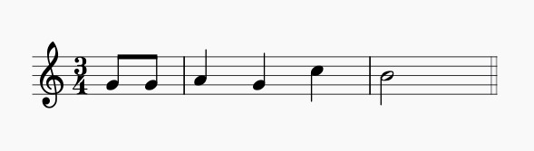

# Music plugin for litecanvas

Plugin to compose and play music in [litecanvas](https://github.com/litecanvas/engine) games using ZzFX.

## Install

**NPM**: `npm i @litecanvas/plugin-music`

**CDN**: `https://unpkg.com/@litecanvas/plugin-music/dist/dist.js`

## Introduction

To compose a music you must use the function `music(bpm, notes, instrument)` that accepts 3 arguments:

- `bpm` means "beats per minute" (the music tempo);
- `notes` is array of arrays of the musical notes (A, B, C, etc). This plugins supports notes from C4 to B5.
- `instrument` is a ZzFX sound used as a "timbre". This argument is optional.

### Notes

Each note is a array with 2 numbers: the first number is the note and the second is the duration of that note. Example: `[1, 4]` is a C4 (Dó) with 4 beats of duration.

See all avaliable notes in the table below:

| Note |  Number   |
| :--: | :-------: |
|  0   | "silence" |
|  1   |    C4     |
|  2   |    D4     |
|  3   |    E4     |
|  4   |    F4     |
|  5   |    G4     |
|  6   |    A4     |
|  7   |    B4     |
|  8   |    C5     |
|  9   |    D5     |
|  10  |    E5     |
|  11  |    F5     |
|  12  |    G5     |
|  13  |    A5     |
|  14  |    B5     |

> Note: to indicate a flat (♭) or sharp (♯), add or reduce `0.5` to the note number.
> Example: C sharp 4 (C#4) is `1.5`.

## Usage



```js
import litecanvas from "litecanvas"
import pluginMusic from "@litecanvas/plugin-music"

litecanvas({
  loop: { init, tapped },
})

use(pluginMusic) // load the plugin

function init() {
  const musicNotes = [
    [5, 0.5], // Happy
    [5, 0.5],
    [6, 1], // Birthday
    [5, 1],
    [8, 1], // to
    [7, 2], // you
  ]
  happyBirthday = music(120, musicNotes)
}

function tapped() {
  // tap to play the music
  if (!happyBirthday.playing) {
    happyBirthday.play()
  }
}
```
